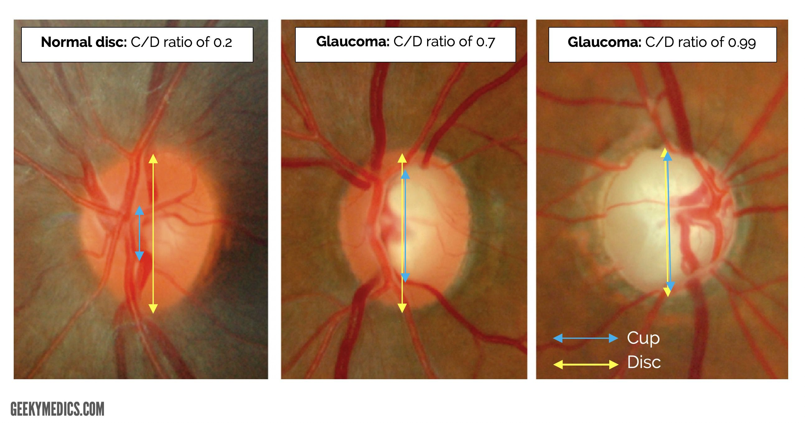
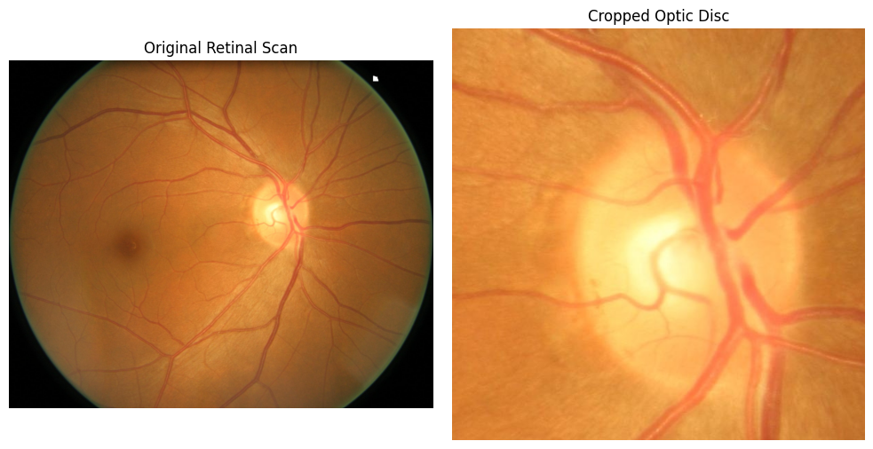

# Automated Glaucoma Detection
**Objective:** Detect the presence of glaucoma using retinal FUNDUS images.
## Introduction
Glaucoma is a group of progressive optic neuropathies characterized by damage to the optic nerve, often associated with elevated intraocular pressure (IOP). It is a leading cause of irreversible blindness worldwide. Clinically, one of the hallmark features of glaucoma is structural damage to the optic nerve head, which can be assessed by examining changes in the cup-to-disc (C/D) ratio.

As of 2024, it is estimated that over 76 million people globally are living with glaucoma. This number is expected to rise to more than 111 million by 2040, driven by an aging global population and improved diagnostic capabilities. The most common form, primary open-angle glaucoma (POAG), progresses slowly and often without symptoms until significant vision loss occurs.

A key diagnostic indicator of glaucomatous optic neuropathy is an increased cup-to-disc ratio. This refers to the enlargement of the optic cup relative to the optic disc as retinal ganglion cells and their axons are lost. While a normal C/D ratio varies among individuals, a progressive increase in this ratio — particularly asymmetrically between the eyes — raises concern for glaucoma and warrants further evaluation.

## Dataset
The data used to train the convolutional neural network is an aggregation of several public datasets bringing the total number retinal scans to ~1,800 images
- RIM-ONE (Retinal Images for Optic Nerve Evaluation)
- DRISHTI-GS
- ORIGA (Online Retinal Fundus Image Database for Glaucoma Analysis)
- ACRIMA

## Data Prep
The original image is a scan of the entire retina but since Glaucoma can be detected using cup-to-disc ratio, it is sufficient to keep only the optic disc region. This was done using Open-CV in python and implementing a function with the following steps:
1. Remove small bright spots in the image using Gaussian Blurring. These bright spots could be a result of machine/data issues and/or the presence of other conditions such as diabetic retinopathy
2. Identify the brightest region in the image, which tends to be the optic disc
3. Create a window around the brightest region and save it as a seperate image

 

 ## Modelling
 To detect the presence of glaucoma we use the following models:
 - **Model 1:** 
